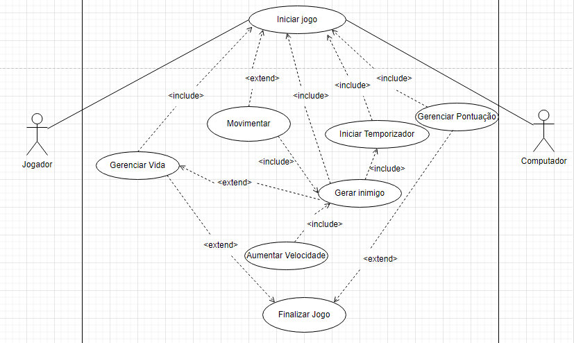
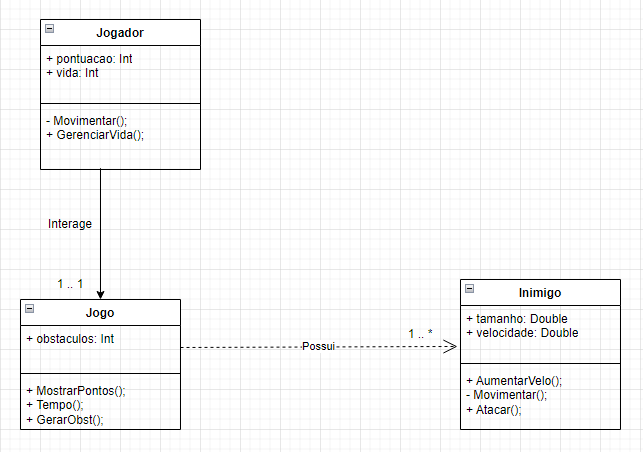
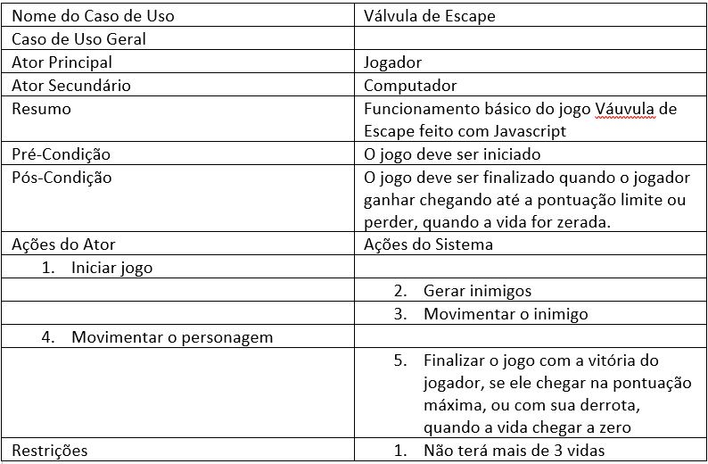
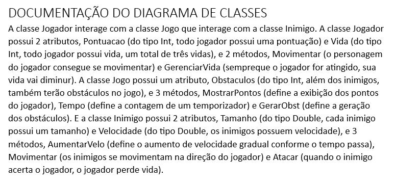

# README ATIVIDADE DE DJW 2 DAS MÚSICAS
README da atividade passada em sala de aula para a matéria de DJW 2, na qual é feito um cenário jogável com o Javascript utilizando uma música como base para a cena.
## COMO É O JOGO?
O jogo é uma continuação da atividade de LP, feita pelo Unity, onde conta sobre um capitão que perdeu sua tripulação por sua ganância e ódio.
O jogo feito com a linguagem Javascript para a matéria de Desenvolvimento de Jogos para a Web é feito em 2D usando o Canvas, usando 
## MÚSICA ESCOLHIDA
Váuvula de Escape, por Anny Koch
## DOCUMENTAÇÃO DE CASOS DE USO E DIAGRAMAS
Diagrama de Casos de Uso
 

Diagrama de Classe
 

Documentação do Caso de Uso
 

Documentação do Diagrama de Classes
 

## AUTORES
Kauan Jesus e Yuri Telis